  <strong>Olá! 👋</strong>

  Sou <strong>Lucas Nunes</strong>, estudante de Análise e Desenvolvimento de Sistemas e desenvolvedor <strong>Front-end em formação</strong>.

  Atualmente, estudo e desenvolvo projetos com <strong>HTML, CSS e JavaScript</strong>, enquanto aprimoro meus conhecimentos em <strong>React e TypeScript</strong>.

  Busco transformar ideias em soluções funcionais, enquanto evoluo constantemente como desenvolvedor.

### 🛠️ Tecnologias e ferramentas

  

### 📊 Atividade no GitHub

  

### 📫 Contato

  

  

  

